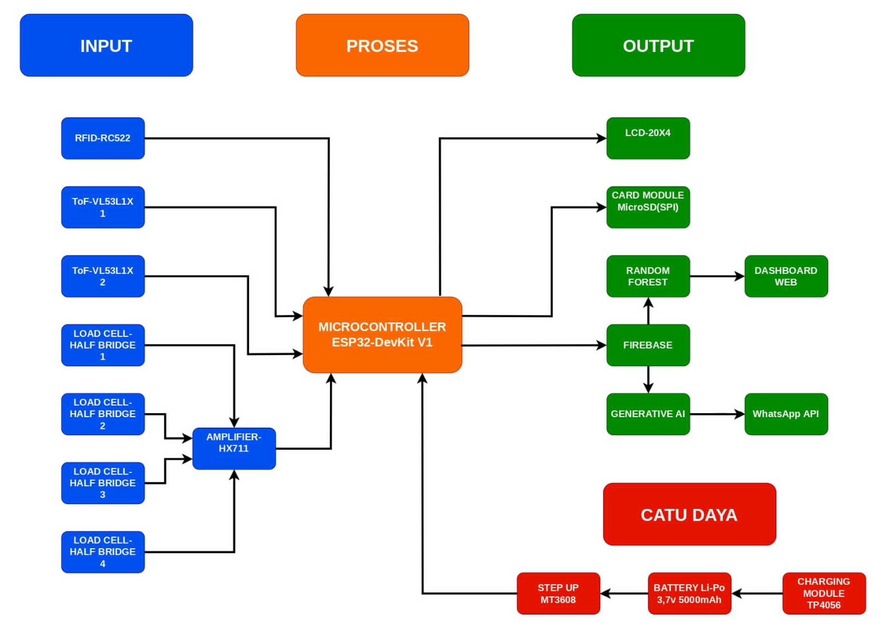
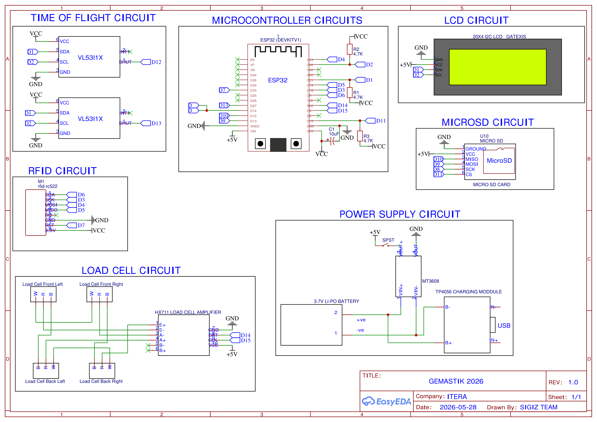
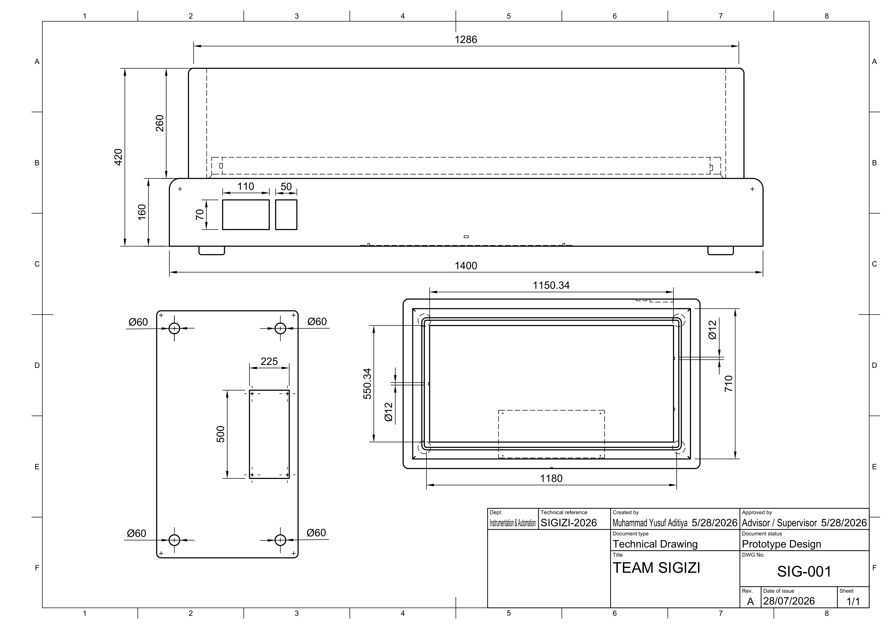
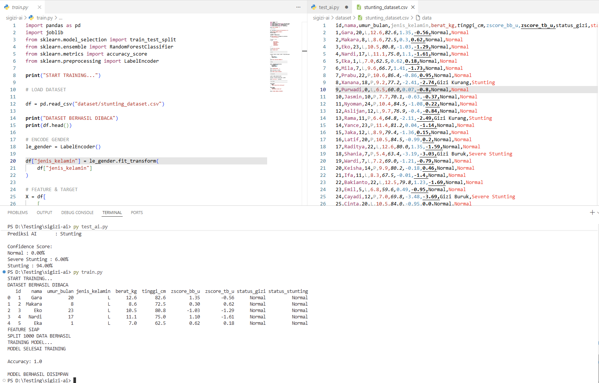
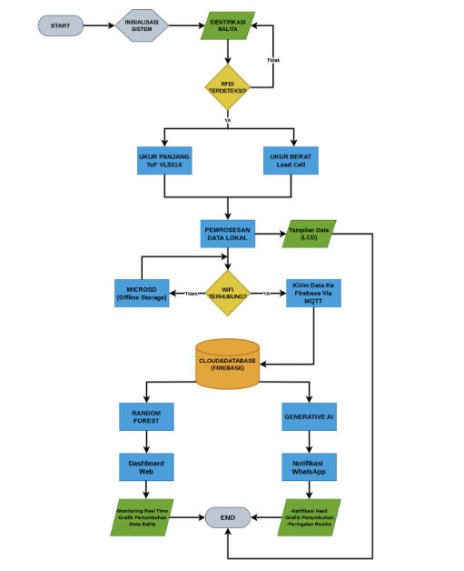

# 🌱 SIGIZI – Smart IoT & Hybrid AI for Early Stunting Detection (0–24 months)

> **Sistem Informasi Gizi dan Identifikasi Posyandu**  
> An integrated IoT device that combines RFID, ToF sensors, load cells, Random Forest classification, and Generative AI (Ollama) to detect stunting risks in toddlers during the critical first 1000 days of life.

---

## 📌 Overview

Stunting affects **150 million children under 5** worldwide. In Indonesia, 19.8% of toddlers are stunted, and most Posyandu still rely on **manual measurements** (hanging scales + tape) – prone to human error and delayed intervention.

**SIGIZI** automates the entire process:
- **RFID** → instant toddler identification  
- **2x VL53L1X ToF sensors** → high‑precision length measurement (non‑contact)  
- **4x load cells + HX711** → accurate weight measurement  
- **Random Forest** → WHO Z‑score classification (normal / stunted / severely stunted)  
- **Generative AI (Ollama + Llama 3.2)** → automatic nutrition intervention recommendations  
- **Real‑time dashboard** (React + Firebase) & **WhatsApp notifications** for parents/health workers  

⏱️ Measurement time: **< 30 seconds** (from 5 minutes manual)  
🎯 Length tolerance: **±0.5%** | Weight tolerance: **±3%**

---

## 🧠 Hybrid AI Architecture

| Layer | Technology | Role |
|-------|------------|------|
| **ML Classification** | Random Forest (scikit‑learn) | Maps age, weight, length → WHO Z‑score (3 classes) |
| **Generative AI** | Ollama + Llama 3.2 / Mistral 7B (local inference) | Produces human‑readable intervention recommendations for parents & clinicians |

The model was trained on a **stratified synthetic dataset** (1000 samples) following WHO growth standards and Indonesian SSGI 2024 prevalence.  
- Train/test split: 80/20  
- Current accuracy: **85%** (target ≥95% after fine‑tuning)

---

## 🛠️ Tech Stack

### Hardware
- **Microcontroller** : ESP32 DevKit V1  
- **Length sensing** : 2× VL53L1X Time‑of‑Flight (I²C)  
- **Weight sensing** : 4× 50kg half‑bridge load cells + HX711 (24‑bit ADC)  
- **Identification** : RFID RC522 (MFRC522, SPI)  
- **Display** : LCD 20×4 (I²C)  
- **Storage** : MicroSD module (offline backup)  
- **Power** : Li‑Po 5000mAh + TP4056 charger + MT3608 step‑up (5V)  

### Software & Cloud
- **Firmware** : Arduino / ESP-IDF (moving average filter, WiFi/MQTT)  
- **Backend** : FastAPI (WebSocket for ESP32), Flask (ML inference), Node.js (reverse proxy)  
- **Database** : Firebase Firestore + Realtime Database (RBAC)  
- **Frontend** : React.js (dashboard with growth charts, analytics)  
- **Notifications** : WhatsApp Business API + PDF report generator  

---

## 📐 System Architecture

### IoMT 3‑Layer Architecture

[ Perception Layer ] → [ Network Layer ] → [ Application Layer ]
ToF, load cell, WiFi / MQTT Random Forest + GenAI
RFID, LCD (offline SD backup) Dashboard + WhatsApp

  
*Figure: Three‑layer IoMT structure of SIGIZI (from proposal Fig. 2.3)*

### Block Diagram
  
*Figure: Overall system blocks – input, process, output, power (Fig. 3.2)*

---

## 🔌 Schematics & 3D Design

### Electronics Schematic (ESP32 wiring)
  
*Figure: Complete wiring diagram – I²C (ToF + LCD), SPI (RFID + SD), HX711 on GPIO 16/4 (Fig. 4.2)*

### 3D Technical Drawing
  
*Figure: CAD drawing with dimensions and internal layout (Fig. 4.1)*

### 3D Rendered Mockup
  
*Figure: Render of the final device with acrylic measuring panel and sliding ToF rails (Fig. 4.3 & 4.4)*

---

## 🤖 Machine Learning Training

- **Dataset** : 1000 synthetic records (age 0‑24 months, weight, length, Z‑score label)  
- **Stratification** : based on real SSGI 2024 prevalence (0‑5, 6‑11, 12‑24 months)  
- **Algorithm** : Random Forest (n_estimators=100, max_depth=10)  
- **Features** : age (months), weight (kg), length (cm)  
- **Target** : 3 classes – Normal (Z ≥ -2), Stunted (-3 ≤ Z < -2), Severely Stunted (Z < -3)  

  
*Figure: Training process and accuracy evolution (Fig. 3.5)*

**Current progress** : 85% accuracy on test set. Next steps: hyperparameter tuning + real‑world data from Posyandu.

---

## 📊 Dashboard & Real‑Time Monitoring

- **Live toddler list** with RFID‑linked profiles  
- **WHO growth charts** (weight‑for‑age, length‑for‑age)  
- **Z‑score visualisation** and historical trends  
- **Role‑based access** : kader, health workers, parents (via WhatsApp)  

  
*Figure: Main monitoring dashboard – toddler list & growth chart (Fig. 3.3)*

  
*Figure: Analytics view – stunting prevalence distribution (Fig. 3.4)*

---

## ⚙️ How It Works (Flow)

1. **Power‑on self‑test** (sensors, SD card, battery level)  
2. **Tap RFID card** → toddler identified  
3. **Simultaneous measurement** : ToF sensors capture length (average of multiple readings) + load cells capture weight  
4. **Data filtering** : moving average (window=5, 10 Hz) on ESP32  
5. **Connectivity** : if WiFi available → send to Firebase; else → store on MicroSD (auto‑sync later)  
6. **Hybrid AI** :  
   - Random Forest computes Z‑score & classification  
   - Generative AI (Ollama) produces personalised intervention text  
7. **Output** :  
   - Dashboard updates in real‑time  
   - If Z < -2 SD → WhatsApp message sent to parents with AI‑generated advice  

  
*Figure: Operational flowchart (Fig. 5.1)*

---

## 📈 Target Performance

| Parameter | Target | Current |
|-----------|--------|---------|
| Length accuracy | ≥94.5% (±0.5%) | To be validated after calibration |
| Weight accuracy | ≥97.0% (±3.0%) | To be validated |
| Random Forest accuracy | ≥95% | 85% (improving) |
| GenAI response time | <5 sec | ~3‑4 sec |
| End‑to‑end cycle | <5 sec | Not yet measured |
| Offline sync success | 100% | Design verified |

---

## 📁 Repository Structure

SIGIZI/
├── firmware/ # ESP32 code (acquisition, filtering, MQTT)
├── backend/
│ ├── fastapi/ # WebSocket for ESP32
│ ├── flask/ # Random Forest inference endpoint
│ └── node/ # Reverse proxy & message broker
├── frontend/ # React.js dashboard
├── ml/ # Jupyter notebooks – training & evaluation
├── docs/ # Datasheets, references, proposal PDF
├── images/ # All schematics, 3D renders, screenshots
└── README.md

---

## 👥 Team

| Name | Role |
|------|------|
| **Muhammad Yusuf Aditya** | System architect, dashboard, AI integration |
| **Rafi Rafsanjani** | Firmware, sensor filtering, hardware assembly |
| **Dimas Rifai** | Calibration, field testing, final documentation |

*Institut Teknologi Sumatera (ITERA) – Instrumentation & Automation Engineering*

---

## 🚧 Current Progress (as of proposal)

| Component | Progress |
|-----------|----------|
| Schematic & wiring | ✅ 100% |
| 3D design & STL files | ✅ 100% |
| Firebase dashboard | ✅ 100% |
| Random Forest training | 🔄 85% |
| GenAI (Ollama) integration | 🔄 80% |
| WhatsApp + PDF reports | 🔄 90% |
| ESP32 firmware (basic) | 🔄 60% |
| Physical assembly | ⏳ 0% (ready to print) |

**Overall cumulative progress** ≈ **72%** (software & backend >85%).

---

## 🧪 Next Steps

- Fabrikasi casing (3D print from STL files)  
- Kalibrasi ToF dan load cell  
- Uji lapangan di Posyandu (Lampung) dengan 50‑100 balita  
- Fine‑tune Random Forest with real‑world data  
- Publish final performance report  

---

## 📄 License

This project is submitted for **GEMASTIK XVIII 2026** (Piranti Cerdas / IoT division).  
For academic & non‑commercial use only.

---

## 📬 Contact

For collaboration or questions, please open an issue or reach out to the team via [GitHub Discussions].

---

> *“Deteksi dini, intervensi tepat – wujudkan generasi bebas stunting.”*
